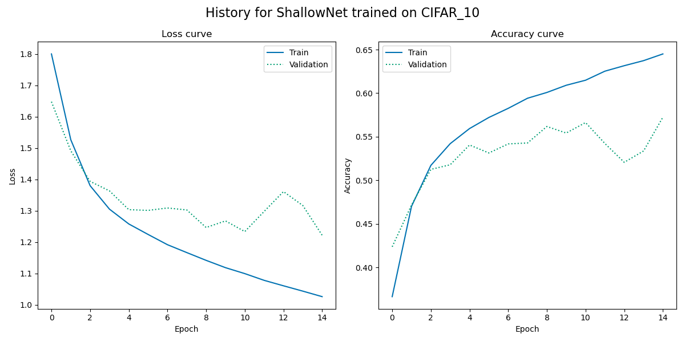
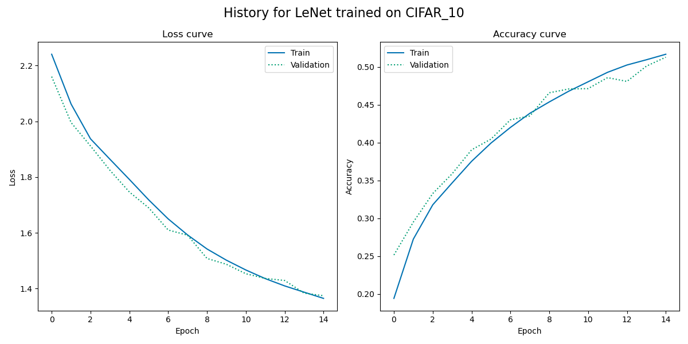

# Assignment 2 – Image classifier benchmark scripts
The portfolio for __Visual Analytics S22__ consists of 4 projects (3 class assignments and 1 self-assigned project). This is the __second assignment__ in the portfolio.

## 1. Contribution
The initial assignment was made partly in collaboration with others from the course, but the final code is my own. I made several adjustments to the code since I first handed it in during the course.

The [`neuralnetwork.py`](https://github.com/agnesbn/VIS_assignment2/blob/main/utils/neuralnetwork.py) script in the `utils` folder was made by Ross and the [`save_history()`](https://github.com/agnesbn/VIS_assignment2/blob/e8f29b235d99b65eaf6a0c4d89936ca5b6608a74/src/nn_classifier.py#L83) function was similarly inspired by one provided by Ross during the course.

Furthermore, [this blog post](https://medium.com/mlearning-ai/lenet-and-mnist-handwritten-digit-classification-354f5646c590) helped me to get the **MNIST_784** data into the correct shape for **LeNet** and **ShallowNet** models to train on it.

## 2. Assignment description by Ross
### Main task
For this assignment, you will take the classifier pipelines we covered in lecture 7 and turn them into *two separate ```.py``` scripts*. Your code should do the following:

- One script should be called ```logistic_regression.py``` and should do the following:
  - Load either the **MNIST_784** data or the **CIFAR_10** data
  - Train a Logistic Regression model using ```scikit-learn```
  - Print the classification report to the terminal **and** save the classification report to ```out/lr_report.txt```
- Another scripts should be called ```nn_classifier.py``` and should do the following:
  - Load either the **MNIST_784** data or the **CIFAR_10** data
  - Train a Neural Network model using the premade module in ```neuralnetwork.py```
  - Print output to the terminal during training showing epochs and loss
  - Print the classification report to the terminal **and** save the classification report to ```out/nn_report.txt```

### Bonus tasks
- Use ```argparse()``` so that the scripts use either **MNIST_784** or **CIFAR_10** based on some input from the user on the command line
- Use ```argparse()``` to allow users to define the number and size of the layers in the neural network classifier.
- Write the script in such a way that it can take either **MNIST_784** or **CIFAR_10** or **any data that the user wants to classify**
  - You can determine how the user data should be structured, by saying that it already has to be pre-processed or feature extracted.


## 3. Methods
### Main tasks
#### Logistic Regression model
The [`logistic_regression.py`](https://github.com/agnesbn/VIS_assignment2/blob/main/src/logistic_regression.py) script uses different functions to load and process respectively the **MNIST_784** and the **CIFAR_10** data sets, so that they are returned in the same format, split, normalised and reshaped (if necessary). This data is then used as input in a logistic regression classifier function, which creates a model, predicts classes of the validation data based on the model, and creates and saves a classification report.

#### Neural Network model
The [`nn_classifier.py`](https://github.com/agnesbn/VIS_assignment2/blob/main/src/nn_classifier.py) script uses the same loading and processing functions as the previously mentioned ones. The output from these functions are then used to train a network classification model. The respective model is compiled and trained on the input data, the history is saved, and the final evaluation of the model is saved in the form of a classification report and a history plot.

### Bonus tasks
As for the bonus tasks, I used ```argparse()``` to allow for the script to be used on either **MNIST_784** or **CIFAR_10** based on input from the command line. Though I did not allow for users to define the number and size of layers in the neural network classifier, I did allow for them to specify which neural network model to apply to the data, providing a number for different model types: simple neural networks using **NumPy** or **TensorFlow**, and more complex neural networks using either a **ShallowNet** or **LeNet** architecture. With more time, the two final bonus tasks could be done by tweaking the scripts I have provided in this repository.

## 4. Usage
### Install packages
Before running the script, run the following from the command line:
```
pip install --upgrade pip
pip install opencv-python scikit-learn tensorflow
sudo apt-get update
sudo apt-get -y install graphviz
```

### Logistic Regression model
Make sure your current directory is the `VIS_assignment2` and then run:
```
python src/logistic_regression.py --dataset <DATASET>
```
`<DATASET>` represents the given dataset you wish to train the model with. Here, you can put in either `cifar10` or `mnist784`.

The output is then saved in [`out/lr`](https://github.com/agnesbn/VIS_assignment2/tree/main/out/lr).

### Neural Network model
Make sure your current directory is the `VIS_assignment2` and then run:
```
python src/nn_classifier.py --dataset <DATASET> --model <NN_MODEL> (--epochs <EPOCHS>)
```
__Input:__
- `<DATASET>` represents the given dataset you wish to train the model with. Here, you can put in either `cifar10` or `mnist784`.
- `<NN_MODEL>` represents the given Neural Network model you wish to apply to the data. Here, you can put in `numpy`, `tensorflow`, `shallownet`, or `lenet`.
- `<EPOCHS>` represents the number of epochs you wish to train your data in. If the argument is omitted, the default value, `15`, is used.

The output is then saved in [`out/nn`](https://github.com/agnesbn/VIS_assignment2/tree/main/out/nn).

## 5. Discussion of results
After running each model on both data sets for 15 epochs, the accuracy scores were:
| Accuracy after 15 epochs 	| Logistic 	| NumPy 	| TensorFlow 	| ShallowNet 	| LeNet 	|
|--------------------------	|----------	|-------	|------------	|------------	|-------	|
| MNIST_784                	| 0.90     	| 0.93  	| 0.92       	| 0.98       	| 0.97  	|
| CIFAR_10                 	| 0.31     	| 0.37  	| 0.42       	| 0.55       	| 0.51  	|

The best performing model for both data sets was **ShallowNet** with 98% accuracy for MNIST_784 and 55% for CIFAR_10. What's more, the training curve for both the MNIST_784 and CIFAR_10 data suggests that with longer training time training loss would continuously decrease (and thus accuracy would continue to increase).

**MNIST_784**                            |  **CIFAR_10**
:---------------------------------------:|:---------------------------------------:
  |  

The next best performing model was **LeNet** with 97% accuracy for MNIST_784 and 51% for CIFAR_10. Only the training curve for the CIFAR_10 data suggests that the training and test loss would decrease and thus accuracy increase with more training. The curve for MNIST_784 seems to have flattened out long before the 15th epoch. 
**MNIST_784**                            |  **CIFAR_10**
:---------------------------------------:|:---------------------------------------:
  |  

Changing the number of epochs relative to the input data and the model would most likely give better results than the ones provided here after 15 epochs training.
